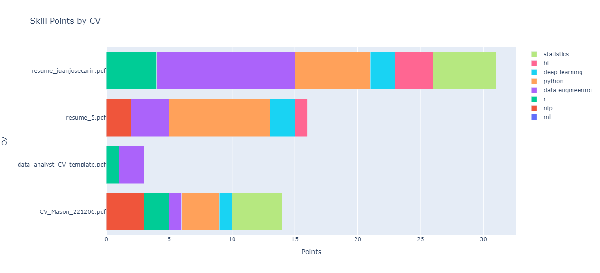

# Data Science CV Screening with NLP

## Case Problem & Solution
Receiving 100 to 500 applications for a Data Science role can lead to time challenges when it comes to identifying the right candidates. The large volume of applications may require significant time to review each one, increasing the workload for the hiring team.

To make things easier, the hiring team could define specific skills for the Data Science role and look for them with a simple keyword approach.

## Methodology
Use tokenization to identify key skills mentioned. 

**1. Create a table with all skills needed**  
In a CSV file I included the key skills by area:
* BI
* Data Engineering
* Statistics
* R
* Python
* NLP
* Deep Learning

Data Science covers many different areas and requires various skills. Some companies want people with a mix of skills, while others prefer specialists in certain areas.

**2. Extract text from PDF**  
Use an existent PDF reader library to extract the text. I used **pdfplumber** as it was providing the most accurate results out of all the other libraries I used.

**3. Tokenize words with nltk**  
Split the text from the CVs into individual tokens to search for the skills needed.

**4. Assign points to the skills**  
Count the occurrence of the tokens under each skill area. For each skill mentioned, the candidate would get one point. 
Finally, the results are ploted in a stacked bar chart to get an overview on the strengths of each candidate by area.

### Requirements
* **Reading data** - pandas, os
* **Extracting text from PDFs** - pdfplumber
* **Natural language processing** - nltk
* **Plotting** - plotly

### Data
I downloaded template CVs from the internet.

## Results

In this simple scenario of reviewing just 4 CVs, one candidate clearly stands out for having a wider range of skills compared to the others. Note, the simplifications was done for visualization reasons.

## Limitations
**PDF reader library**  
The current existent libraries in Python, are not 100% reliable. Sometimes the text is cut out, therefore the results might be
suboptimal. 

**Lack of context understanding**  
It's important to note that a method based on keywords lacks the ability to understand the context in which words are used. 
This can lead to false positives (candidates overusing keywords to be accepted) or false negatives.

**Soft skills are disregarded**  
Keyword-based screening overlooks important soft skills, that might be relevant.

## Future considerations  
If one wants to apply more fancy screening, there are available tools on the market, such as SkillPool.
It would probably not pay off to build a tool yourself as the costs for development might outweigh the benefit,
especially knowing that it's not a recurring problem.